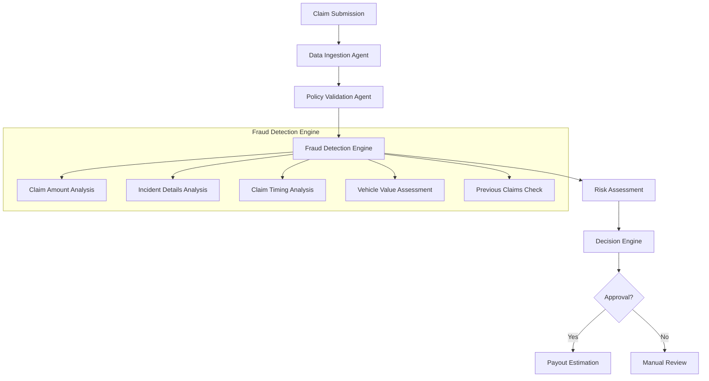

insurance + Google ADK + multi-agent workflows

Use Case: Automated Claims Processing & Validation Assistant Business Problem Insurance claims processing involves multiple steps:

Collecting claim details (structured + unstructured docs)

Validating policy coverage

Checking for fraud

Estimating payout

Notifying customer

This is usually manual, slow, and error-prone.

# 🏥 Insurance Claims Processing with Google ADK

[](https://github.com/sinha4ravi/adk-insurance-lab)
[](https://www.python.org/downloads/)
[](https://opensource.org/licenses/MIT)
[](https://github.com/sinha4ravi/adk-insurance-lab)

Automated Claims Processing & Validation Assistant built with Google's Agent Development Kit (ADK). This system streamlines the insurance claims process using AI-powered agents that handle each step of the workflow.

## Business Problem

Insurance claims processing traditionally involves multiple manual steps that are slow, costly, and prone to errors:

- Collecting claim details (structured + unstructured documents)
- Validating policy coverage
- Checking for potential fraud
- Estimating payouts
- Notifying customers

Our solution automates this entire workflow using specialized AI agents, reducing processing time from days to minutes while improving accuracy and consistency.

## 🚀 Key Benefits

<div style="display: flex; flex-wrap: wrap; gap: 20px; margin: 20px 0;">
    <div style="flex: 1; min-width: 300px; background: #f5f7fa; padding: 20px; border-radius: 8px;">
        <h3>⏱️ Faster Processing</h3>
        <p>Reduce claim processing time from days to minutes with automated workflows and AI-powered decision making.</p>
    </div>
    <div style="flex: 1; min-width: 300px; background: #f5f7fa; padding: 20px; border-radius: 8px;">
        <h3>🎯 Improved Accuracy</h3>
        <p>AI-powered validation reduces human error and ensures consistent claim evaluation.</p>
    </div>
    <div style="flex: 1; min-width: 300px; background: #f5f7fa; padding: 20px; border-radius: 8px;">
        <h3>💰 Cost Efficient</h3>
        <p>Lower operational costs through automation and reduced manual processing.</p>
    </div>
</div>

<div style="display: flex; flex-wrap: wrap; gap: 20px; margin: 20px 0;">
    <div style="flex: 1; min-width: 300px; background: #f5f7fa; padding: 20px; border-radius: 8px;">
        <h3>📈 Scalable</h3>
        <p>Easily handle varying claim volumes without additional resources.</p>
    </div>
    <div style="flex: 1; min-width: 300px; background: #f5f7fa; padding: 20px; border-radius: 8px;">
        <h3>📋 Audit Trail</h3>
        <p>Complete documentation of all processing steps for compliance and review.</p>
    </div>
    <div style="flex: 1; min-width: 300px; background: #f5f7fa; padding: 20px; border-radius: 8px;">
        <h3>🔌 Seamless Integration</h3>
        <p>Easily connects with existing policy management systems and data sources.</p>
    </div>
</div>

## 🏗️ Workflow Overview

Below is the complete claims processing workflow implemented by our system:

### Agent Responsibilities

1. **Data Ingestion Agent**
   - Processes both structured and unstructured claim documents
   - Extracts relevant information using AI/ML models
   - Normalizes data for downstream processing

2. **Policy Validation Agent**
   - Verifies claim against policy terms and conditions
   - Checks coverage limits and exclusions
   - Validates claim eligibility

3. **Fraud Check Agent**
   - Analyzes claim patterns for potential fraud
   - Cross-references with historical claims data
   - Flags suspicious claims for review

4. **Payout Estimator Agent**
   - Calculates estimated claim value
   - Considers policy limits and deductibles
   - Generates final settlement amount

## 🛠️ Installation

1. Clone the repository:
   ```bash
   git clone https://github.com/sinha4ravi/adk-insurance-lab.git
   cd adk-insurance-lab
   ```
   
   Or use GitHub CLI:
   ```bash
   gh repo clone sinha4ravi/adk-insurance-lab
   cd adk-insurance-lab
   ```

2. Create and activate a virtual environment:
   ```bash
   python -m venv venv
   source venv/bin/activate  # On Windows: venv\Scripts\activate
   ```

3. Install dependencies:
   ```bash
   pip install -r requirements.txt
   ```

4. Set up environment variables:
   ```bash
   cp .env.example .env
   # Edit .env with your configuration
   ```

## 🚀 Usage

### Running the Web Interface

```bash
adk web
```
Then open http://localhost:8000 in your browser.

### Programmatic Usage

```python
from insurance_agent import InsuranceClaimProcessor
import asyncio

async def process_claim():
    processor = InsuranceClaimProcessor()
    
    result = await processor.root_agent.tools[0]._run({
        "policy_number": "POL123456",
        "claim_amount": 5000,
        "incident_details": "Car accident on Main St",
        "supporting_documents": ["doc1.pdf", "photo1.jpg"]
    })
    
    print("Claim processing result:", result)

# Run the async function
asyncio.run(process_claim())
```

## 📚 Documentation

For detailed documentation, please see:

- [Architecture Overview](docs/architecture.md) - High-level system design and components
- [Fraud Detection System](docs/fraud_detection_architecture.md) - Detailed fraud detection workflow and components
- [API Reference](docs/api.md) - API endpoints and usage examples
- [Development Guide](docs/development.md) - Local setup and contribution guidelines
- [Deployment Guide](docs/deployment.md) - Production deployment instructions

## 🤝 Contributing

Contributions are welcome! Please read our [Contributing Guide](CONTRIBUTING.md) for details on our code of conduct and the process for submitting pull requests.

## 📄 License

This project is licensed under the MIT License - see the [LICENSE](LICENSE) file for details.

## 🙏 Acknowledgments

- Google ADK Team for the Agent Development Kit
- All contributors who have helped improve this project

---

<div align="center">
  Made with ❤️ by Your Name
</div>

## Features


## 🏗️ System Architecture

The system follows a modular, agent-based architecture designed for scalability and maintainability. Below is a high-level overview of the architecture:



### Core Components

1. **Data Ingestion Agent**
   - Validates and normalizes incoming claim data
   - Processes both structured and unstructured documents
   - Enriches data with additional context

2. **Policy Validation Agent**
   - Verifies policy details and coverage
   - Checks policy status and effective dates
   - Validates claim against policy terms

3. **Fraud Detection Engine**
   - Comprehensive fraud detection with multiple analysis modules
   - Real-time risk scoring and fraud indicators
   - Detailed documentation available in [Fraud Detection Architecture](docs/fraud_detection_architecture.md)

4. **Payout Estimator Agent**
   - Calculates the approved payout amount
   - Considers policy limits and deductibles
   - Generates final settlement proposal

5. **Coordinator Agent**
   - Manages the workflow between all agents
   - Handles error recovery and retries
   - Maintains audit trail of all processing steps

For a detailed view of the fraud detection architecture, see the [Fraud Detection System Documentation](docs/fraud_detection_architecture.md).

## 🤝 Contributing

We welcome contributions! Please see our [Contribution Guidelines](CONTRIBUTING.md) for details on how to get started.

## 📄 License

This project is licensed under the MIT License - see the [LICENSE](LICENSE) file for details.

🔹 How Google ADK fits Sequential Workflow (Step-by-Step Claims Flow)

Agent A (Data Ingestion Agent): Reads claim form, extracts key info (policy number, damage description).

Agent B (Policy Validation Agent): Checks coverage rules (does policy cover this type of claim?).

Agent C (Fraud Check Agent): Flags suspicious patterns (duplicate claims, unusual claim sizes).

Agent D (Payout Estimator): Suggests a settlement amount based on claim type + history.

Each runs sequentially, passing output to the next step.

Parallel Workflow (Faster Validation)

Policy Validation Agent and Fraud Check Agent can run in parallel because they don’t depend on each other.

This cuts processing time (important for scaling).

Multi-Agent Workflow (Specialized Collaboration)

A Coordinator Agent (like an ADK “router”) decides which specialized agents to trigger:

Simple claims? → Skip Fraud Check, just Policy Validation + Payout.

Complex/high-value claims? → Run all agents including Fraud + Extra Audit Agent.

This shows ADK’s ability to route dynamically and avoid wasted compute.

🔹 Why This is a Good POC Simple enough to demo quickly (small dataset, mock rules).

Relatable business value → faster, more accurate claims processing.

Highlights ADK strengths:

Sequential workflows (A → B → C → D).

Parallel workflows (fraud + validation).

Multi-agent collaboration (different “experts” working together).