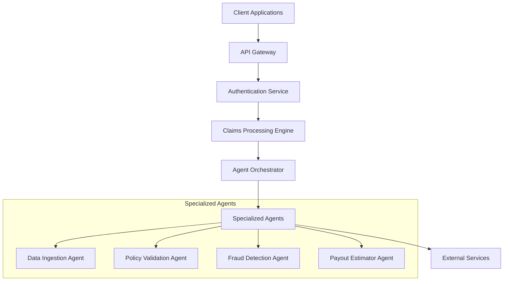

# System Architecture

## Overview
This document provides a high-level overview of the Insurance Claims Processing System architecture.

## High-Level Architecture

## Components

### API Gateway
- Entry point for all client requests
- Handles request routing
- Rate limiting and throttling
- Request/response transformation

### Authentication Service
- Manages user authentication
- Handles API key validation
- Manages permissions and roles

### Claims Processing Engine
- Core workflow management
- State management
- Error handling and retries
- Audit logging

### Agent Orchestrator
- Manages agent lifecycle
- Handles inter-agent communication
- Load balancing between agents
- Monitoring and metrics collection

## Data Flow

1. Client submits claim through API
2. Request is authenticated and authorized
3. Claim is validated and enriched
4. Processing workflow is triggered
5. Specialized agents process the claim in parallel where possible
6. Results are aggregated and final decision is made
7. Response is returned to client

## Integration Points

- Policy Management System
- Document Storage Service
- Payment Processing System
- Notification Service
- Analytics and Reporting

## Scaling Considerations

- Stateless services for horizontal scaling
- Message queues for async processing
- Caching layer for frequently accessed data
- Database read replicas for read-heavy operations
