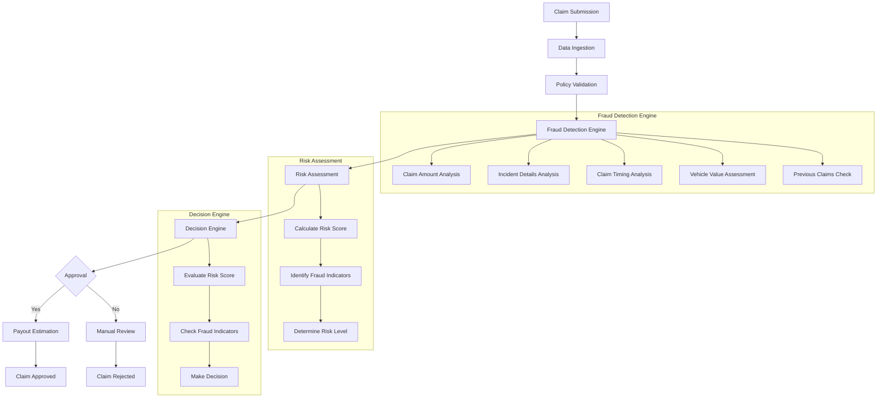

# Fraud Detection System Architecture

## Overview
This document outlines the architecture of the Insurance Fraud Detection System, which is designed to identify potentially fraudulent insurance claims using a multi-layered analysis approach.

## System Architecture

## Key Components

### 1. Data Ingestion
- Validates and processes incoming claim data
- Extracts and normalizes relevant information
- Enriches data with additional context

### 2. Policy Validation
- Verifies policy details and coverage
- Checks policy status and effective dates
- Validates claim against policy terms

### 3. Fraud Detection Engine
#### 3.1 Claim Amount Analysis
- Identifies unusually high claim amounts
- Compares claim amount to vehicle value
- Checks for round number claims

#### 3.2 Incident Details Analysis
- Analyzes incident description for red flags
- Detects minor damage with high claims
- Identifies suspicious patterns in incident reports

#### 3.3 Claim Timing Analysis
- Checks for new policy fraud
- Identifies claims near policy expiration
- Analyzes time-based patterns

#### 3.4 Vehicle Value Assessment
- Estimates current vehicle value
- Calculates claim-to-value ratio
- Flags excessive claims

#### 3.5 Previous Claims Check
- Reviews claim history
- Identifies frequent claimants
- Checks for patterns of suspicious activity

### 4. Risk Assessment
- Calculates comprehensive risk score (0.0 - 1.0)
- Identifies specific fraud indicators
- Determines overall risk level

### 5. Decision Engine
- Makes approval/rejection recommendations
- Flags claims for manual review
- Provides reasoning for decisions

## Data Flow

1. **Claim Submission**: Policyholder submits claim with details and documentation
2. **Initial Processing**: System validates and enriches claim data
3. **Fraud Detection**: Multiple analysis modules evaluate the claim
4. **Risk Scoring**: System calculates overall risk based on analysis
5. **Decision Making**: Automated decision is made based on risk assessment
6. **Action**: Claim is approved, rejected, or flagged for review

## Integration Points

- Policy Management System
- Vehicle Valuation Service
- Claims History Database
- Document Management System
- Payment Processing System

## Monitoring and Reporting

- Real-time fraud alerts
- Comprehensive audit logs
- Performance metrics and dashboards
- Regular system health checks

## Security Considerations

- Data encryption in transit and at rest
- Role-based access control
- Audit logging for all system actions
- Regular security assessments
